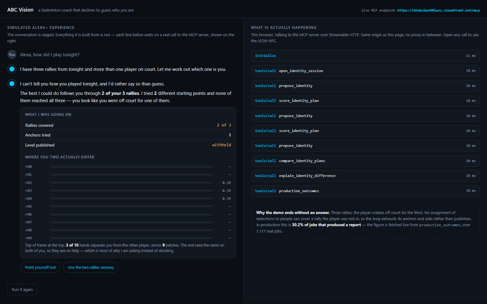

# ABC Vision MCP

An MCP server that exposes a production badminton video-analysis engine as
agent tools — and records, at every branch point, how a measured visual result
changed what the system did next.

Built on **OpenCV 5.0.0**. Speaks **MCP over Streamable HTTP**.

---

## It is running. Go and look.

| | |
|---|---|
| Simulated Alexa+ experience | **https://d2xks2we90iwvv.cloudfront.net/** |
| The MCP server it calls | `https://d2xks2we90iwvv.cloudfront.net/mcp` |



The conversation on the left is staged. Every call on the right is real — this
browser talking to that server over Streamable HTTP, each one openable to its
raw JSON-RPC. The page is served from the same origin as `/mcp`, which is why
there is no proxy in between and nothing that could be a recording.

The demo ends without an answer, and that is the product: three rallies, the
player sits out the third, no assignment of detections to people can cover a
rally the player was not in. The loop tries every anchor, reaches 2 of 3, and
asks instead of publishing.

**Verify the OpenCV version yourself** rather than taking this README's word
for it — call `protocol_info` on that endpoint and it reports the version of
the process that answered you.

Opening `/mcp` in a browser returns a JSON-RPC error about a missing session
ID. That is correct: it is a protocol endpoint, not a web page. The page is at
`/`.

---

## Why this exists

ABC (AI Badminton Coach) is a shipping product: an App Store listing, seven
locales, five jurisdictions' privacy compliance, 527 commits, and 1,117
production jobs over the twelve days to 2026-09-17. Its defining behaviour is
that it refuses to answer when it is not sure — across 1,117 real jobs it
declined to assign a skill level in **30.2%** of the analyses that produced a
report, and recorded a human-readable reason each time.

That refusal is not a UI message bolted on at the end. It is the outcome of a
chain of gates, each fed by a measurement from the vision pipeline: was a court
found, did the camera drift, was the player held long enough, were the serves
segmented cleanly. When a gate fails, the system does something different —
retries with a different anchor, asks the player to identify themselves, or
publishes an analysis with the level withheld.

This server makes that chain callable by an agent, and writes down the
reasoning as it goes.

## What is in here

| Path | What it is |
|---|---|
| `src/abc_vision_mcp/server.py` | The MCP server and its 14 tools |
| `src/abc_vision_mcp/identity.py` | The agent loop: propose, score, exclude the anchor, propose again |
| `src/abc_vision_mcp/trace.py` | Decision trace: tool calls, branch points, and the alternatives not taken |
| `src/abc_vision_mcp/stats.py` | Production statistics, always with both denominators |
| `src/abc_vision_mcp/web/index.html` | The simulated Alexa+ surface served at `/` |
| `src/abc_vision_mcp/demo_fixture.py` | The evidence the demo runs on, shared by the page and the trace script |
| `scripts/demo_agentic_loop.py` | Reproduces the demo run and writes the decision trace |
| `scripts/make_outcomes_chart.py` | Renders `docs/outcomes.svg` from the record — no figure is typed by hand |
| `tests/` | 58 tests, including the redaction properties the trace must hold |
| `data/deidentified/` | Production outcome statistics with every identifier removed |
| `infra/` | AWS deployment: bundler, Dockerfile, CodeBuild |
| `docs/AWS.md` | What runs where, and why it is not what was planned |
| `docs/CORRECTIONS.md` | **What this project published and then found to be wrong** |

## Decisions, not logs

A log of "scan ran, then lock ran" proves nothing — a fixed script produces the
same log. So the trace separates two kinds of record:

- **ToolCall** — what ran, with inputs and outputs. Supporting detail.
- **Decision** — a branch point where a *measured value* selected the next
  action, recorded together with the branches that were **not** taken and the
  rule that maps evidence to branch.

`summary()` reports `branching_decisions` separately from `decisions`, because
a decision with no alternatives did not branch on anything and should not be
presented as if it had.

Example of one real branch, taken from the engine's identity lock
(`core/analysis.py`, `MAX_ANCHOR_ATTEMPTS = 8`): when geometric validation of a
candidate anchor fails, the rejected anchor key is added to an `avoid` set and
the *same tool is called again with different parameters*. The visual result
changed the next tool call. That loop already exists in production; this server
exposes and records it rather than inventing one for a submission.

## Privacy

This repository is built to be handed to competition judges, so it is
structured to make leaking hard rather than to rely on care:

- `.gitignore` is an **allowlist** — everything is ignored, and tracked paths
  are named explicitly. The engine repository used a blocklist, missed five
  directories, and ended up tracking 1,931 data files including customer names
  in filenames. That repository can never be pushed anywhere. This one starts
  from the opposite default.
- The trace redacts by key name, so a field added later called `subject_name`
  is redacted the day it appears. Paths and identifiers become truncated
  SHA-256 handles: stable enough to show two calls hit the same video, useless
  for recovering which video.
- Only de-identified aggregates ship in `data/`. No video, no frames, no
  subject records.
- Redaction is covered by tests, not by convention.

## Requirements

- Python 3.12
- `mcp` 2.2.0 — **negotiated protocol version `2025-11-25`**
- OpenCV 5.0.0 (`opencv-python-headless==5.0.0.93`)

> The SDK also exposes `LATEST_PROTOCOL_VERSION = 2026-07-28`. That is the
> transport revision, not the protocol version, and it is always the higher of
> the two — which makes it the tempting one to quote. An earlier version of
> this README quoted it. See `docs/CORRECTIONS.md`.

## Running

```bash
python -m venv .venv
.venv/Scripts/python -m pip install -r requirements.txt

# stdio, for a local client
.venv/Scripts/python -m abc_vision_mcp.server

# Streamable HTTP on http://127.0.0.1:8931/mcp, with the demo page at /
.venv/Scripts/python -m abc_vision_mcp.server --http
```

Serving on a public interface? Name the hosts you answer to. The SDK enables
DNS rebinding protection only for a loopback bind, so a container that binds
`0.0.0.0` has none unless it asks:

```bash
.venv/Scripts/python -m abc_vision_mcp.server --http --host 0.0.0.0     --allowed-host your.public.name --allowed-origin https://your.public.name
```

Without it the server starts anyway and prints a warning saying what is not
protecting it. `protocol_info` reports the resulting state, so a deployment can
be checked rather than believed.

Tests:

```bash
.venv/Scripts/python -m pytest tests/ -q     # 58 passed
```

Reproduce the decision trace shown on the demo page — no video, no customer
data, production tools:

```bash
.venv/Scripts/python scripts/demo_agentic_loop.py --out traces
# 6 tool calls, 4 decisions, 4 branching, 1 human approval request
```

Check a running server against the spec, with the checker we published for this
(MIT, separate repository):

```bash
pip install git+https://github.com/ekyo0224/mcp-conformance
mcp-conformance https://d2xks2we90iwvv.cloudfront.net/mcp   # 12 checks, 0 failures
```

## Status

Deployed and public, running on AWS for the judging period of two 2026
competitions. 14 tools, 58 tests, OpenCV 5.0.0, negotiated protocol
`2025-11-25`.

The analysis engine itself is **not** in this repository and never will be. A
named allowlist of eleven files is staged at build time inside the owner's own
AWS account, and the build refuses to run if anything resembling customer data
reaches it.
